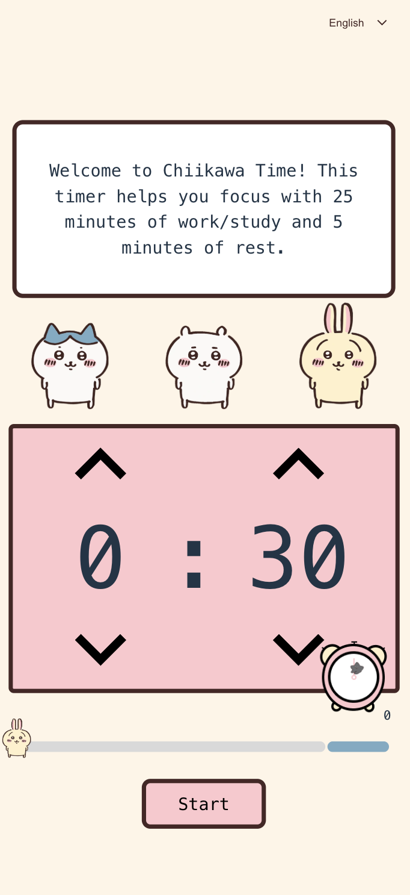

# Chiikawa Timer 

](https://github.com/yourusername/chiikawatimer/issues)

[chiikawatimer.com](https://www.chiikawatimer.com)

## Description
Chiikawa Timer is a fun, **non-commercial** focus clock application designed to boost productivity using the Pomodoro technique. Featuring the adorable Chiikawa character, created by the Japanese author Nagano, this timer adds a touch of charm to your work sessions with delightful animations.

**Important Note:** This project is strictly non-commercial and uses the Chiikawa character under fair use for personal, non-profit purposes. Please respect the copyright of Nagano and do not use this project for commercial activities.

## Features

Customizable length of whole Pomodoro period  (from 10 min - 8 hours) work and break intervals
Cute Chiikawa animations to keep you motivated
User-friendly interface
Cross-platform support (web-based)

## Site
Try it out at [chiikawatimer.com](chiikawatimer.com)

## Usage

Click "Start" to begin a Pomodoro session.
Adjust work/break durations as needed.
Enjoy Chiikawa’s animations while focusing!

## Acknowledgments

Nagano san, Chiikawa author (thanks for creating such a heart warming character)
Inspired by the Pomodoro technique
Built with  React, Node.js

